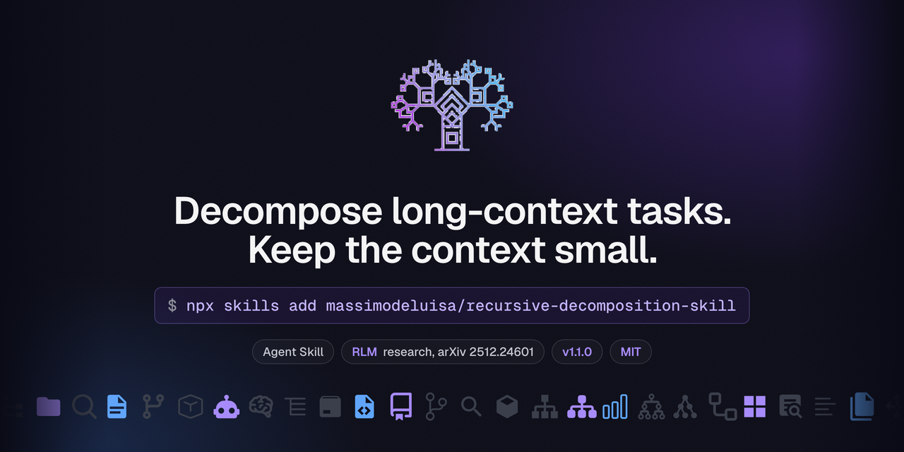

<p align="center">
  <picture>
    <source media="(prefers-color-scheme: dark)" srcset="assets/logo-dark.png">
    
  </picture>
</p>

<h1 align="center">Recursive Decomposition Skill</h1>

<p align="center">
  <strong>Decompose long-context tasks while keeping the context small.</strong><br />
  An <a href="https://agentskills.io">Agent Skill</a> for Claude Code, Codex, Cursor and compatible agents, based on the Recursive Language Models research
</p>

<p align="center">
  <a href="https://skills.sh/massimodeluisa/recursive-decomposition-skill"></a>
  <a href="https://arxiv.org/abs/2512.24601"></a>
  <a href="LICENSE"></a>
  <a href="https://agentskills.io"></a>
</p>

<p align="center">
  <a href="#install">Install</a> ·
  <a href="#usage">Usage</a> ·
  <a href="#how-it-works">How it works</a> ·
  <a href="#eval">Eval</a> ·
  <a href="#repository-structure">Structure</a> ·
  <a href="#acknowledgments">Acknowledgments</a>
</p>

<p align="center">
  
</p>

---

## The problem

Large codebases, dozens of documents, long reports: as the context grows, models miss details, link distant parts by guesswork and lose accuracy. The Recursive Language Models paper calls it context rot.

## What it does

When a task is codebase-wide, multi-document, a pile of PDFs, or a dense aggregate, even if it fits the window, the skill makes the agent treat the input as an environment to query instead of text to swallow:

1. **Size** the input before reading anything.
2. **Filter** the search space with searches, not reads.
3. **Chunk** what remains into batches of 5 to 10 files or natural units.
4. **Recurse** at depth 1 with one sub-agent per batch, each with a self-contained brief. Sub-agents do not spawn sub-agents.
5. **Verify** the merged answer on a small window against the sources.
6. **Synthesise** programmatically, with file and line references.

PDFs go through [anydoc](https://skills.sh/firecrawl/anydoc/convert-documents-to-markdown) first (`npx -y @firecrawl/anydoc FILE -o .firecrawl/out.md`), then grep the markdown. Cloud [`firecrawl parse`](https://skills.sh/firecrawl/cli/firecrawl-parse) is for OCR, `-Q`, or `-S`. A one-page convert job is not this skill.

## Install

With the [skills CLI](https://github.com/vercel-labs/skills):

```bash
npx skills add massimodeluisa/recursive-decomposition-skill
```

Add `-g` for a user-level install, `-a claude-code` (or another agent) to target one agent.

As a Claude Code plugin:

```bash
claude plugin marketplace add massimodeluisa/recursive-decomposition-skill
claude plugin install recursive-decomposition@recursive-decomposition-skill
```

Manual: copy `skills/recursive-decomposition` into `~/.claude/skills/` (or your agent's skills directory) and restart the agent.

## Usage

- `/recursive-decomposition` applies the protocol to the current task.
- `/recursive-decomposition src/` sizes that input first, then runs the protocol.

The skill also activates on its own for prompts like:

```text
Analyze error handling patterns across this entire codebase
Find all TODO comments in the project and categorize by priority
What API endpoints are defined across all route files?
Summarize the key decisions from all meeting notes in docs/
Find security issues across all Python files
```

## How it works

| Situation | Approach |
|-----------|----------|
| One file, one function, or a single needle | Read directly |
| Linear aggregate or list-everything, and completeness matters | Decompose |
| Pairwise, quadratic, or multi-hop across scattered sources | Decompose, even under 30k tokens |
| 10+ files or 50k+ tokens | Decompose |
| Under 30k tokens and a localised answer | Read directly |

Results reported in the [paper](https://arxiv.org/abs/2512.24601):

| Task | Direct model | With RLM |
|------|--------------|----------|
| Multi-hop QA (6 to 11M tokens) | 70% | 91% |
| Linear aggregation | baseline | +28 to 33% |
| Quadratic reasoning | under 0.1% | 58% |
| Context scaling | 2^14 tokens | 2^18 tokens |

RLM runs were about 3x cheaper than summarisation baselines.

## Eval

Fixture is a git submodule, not files copied into this repo: [tccao/mortgage-doc-rag](https://github.com/tccao/mortgage-doc-rag) (MIT), 131 public-domain mortgage PDFs, about 63 MB. Thanks to that project for the corpus.

```bash
git submodule update --init --depth 1 skills/recursive-decomposition/evals/files/mortgage-doc-rag
bash .github/scripts/eval-skill.sh check
```

Pre/post on that tree, same prompt (count, 10 largest, titles from at most three files):

| Path | What ran | Time | Titles from the 3 largest |
|------|----------|------|---------------------------|
| With skill | size first, anydoc on 2 digital PDFs, `firecrawl parse` on 1 scan (anydoc exit 3) | size 0.02 s; anydoc 1.64 s; OCR parse 15.45 s | APPRAISAL OF REAL PROPERTY; TILA RESPA Integrated Disclosure; Uniform Residential Appraisal Report |
| Without skill | `pdftotext` on all 131 PDFs | 1.65 s | two titles from digital PDFs; **empty** on the largest file (scan, 4 bytes) |

The naive path is faster and blind on scans. The skill is slower because it OCRs one file, and that is the file `pdftotext` cannot read. Details: [evals/README.md](skills/recursive-decomposition/evals/README.md).

## Repository structure

```text
recursive-decomposition-skill/
├── .claude-plugin/          plugin.json, marketplace.json (the repo is the plugin)
├── .github/                 bash validator and CI workflow
├── skills/recursive-decomposition/
│   ├── SKILL.md             protocol, rules, patterns
│   ├── references/          rlm-strategies, cost-analysis, codebase-analysis, document-aggregation
│   └── evals/               trigger queries, mortgage PDF submodule, bash scorer
├── assets/                  social preview, logo (light and dark)
├── AGENTS.md · CONVENTIONS.md · CONTRIBUTING.md · CHANGELOG.md
└── LICENSE
```

## Acknowledgments

This skill is based on the **Recursive Language Models** paper. Thanks to the authors:

<table>
  <tr>
    <td align="center"><a href="https://x.com/a1zhang"><b>Alex L. Zhang</b></a><br><sub>MIT CSAIL</sub></td>
    <td align="center"><a href="https://x.com/tim_kraska"><b>Tim Kraska</b></a><br><sub>MIT</sub></td>
    <td align="center"><a href="https://x.com/lateinteraction"><b>Omar Khattab</b></a><br><sub>MIT CSAIL, creator of DSPy</sub></td>
  </tr>
</table>

> **Recursive Language Models**, Alex L. Zhang, Tim Kraska, Omar Khattab, arXiv:2512.24601, December 2025. [Abstract](https://arxiv.org/abs/2512.24601) · [PDF](https://arxiv.org/pdf/2512.24601)

Eval corpus: [tccao/mortgage-doc-rag](https://github.com/tccao/mortgage-doc-rag) (MIT), public-domain mortgage PDFs. Thanks to that project.

PDF conversion: Firecrawl [anydoc](https://skills.sh/firecrawl/anydoc/convert-documents-to-markdown) and [firecrawl-parse](https://skills.sh/firecrawl/cli/firecrawl-parse). Thanks to Firecrawl.

This skill is an independent project and is not affiliated with the paper authors, MIT, tccao, or Firecrawl.

## Author

<p>
  <a href="https://x.com/massimodeluisa"></a>
  <a href="https://github.com/massimodeluisa"></a>
</p>

**Massimo De Luisa**: [massimo.deluisa.bio](https://massimo.deluisa.bio)

## License

MIT, see [LICENSE](LICENSE).
